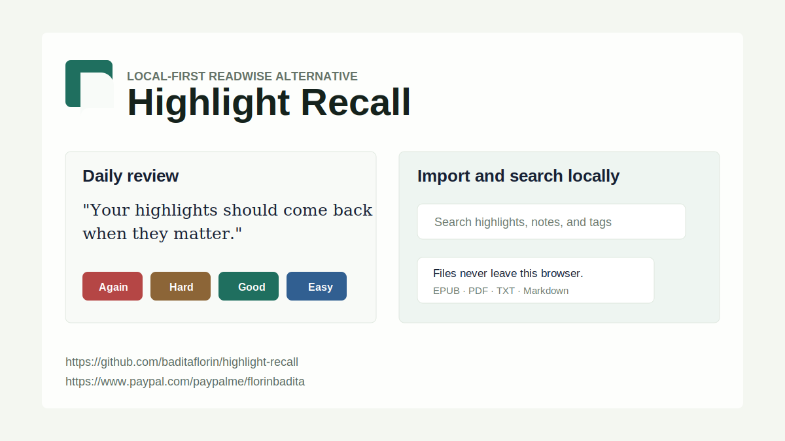
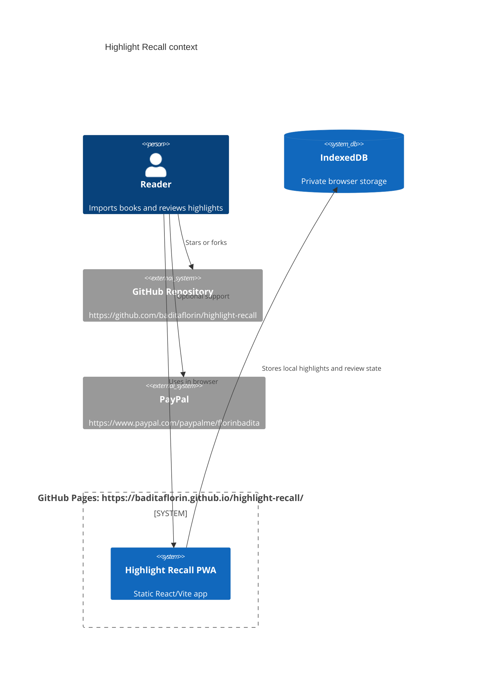

# Highlight Recall

Live app: https://baditaflorin.github.io/highlight-recall/

Repository: https://github.com/baditaflorin/highlight-recall

Support: https://www.paypal.com/paypalme/florinbadita



Highlight Recall is a local-first Readwise-style app for importing EPUB/PDF highlights, reviewing them with spaced repetition, and searching them without sending personal reading data to a server.

## Quickstart

```bash
npm install
make install-hooks
make build
make pages-preview
make smoke
```

## What It Does

- Imports EPUB, PDF, TXT, Markdown, and Highlight Recall state JSON files in the browser.
- Accepts file picker import, drag/drop, manual paste, cleaned HTML paste, clipboard text import, and sample data.
- Stores source documents, highlights, review state, activity, settings, and optional embeddings in browser storage.
- Resurfaces due highlights with an SM-2-style spaced repetition scheduler.
- Searches highlights locally with MiniSearch, with optional browser sentence-transformer embeddings after the user builds the semantic index.
- Exports and restores a versioned JSON state file for browser-to-browser portability.
- Copies review cards, search results, and full state JSON to the clipboard when the browser allows clipboard access.
- Shows version and commit on the live GitHub Pages app, with repository and PayPal links in the footer.

## Verified Checklist

- `make test` covers spaced repetition, text splitting, format detection, state round-trip validation, and persisted settings.
- `make smoke` covers state restore, clipboard import, review scheduling, copy status, local search, and settings persistence.
- The frontend has no runtime backend, no secrets, and no account system.

## Limitations

- Scanned PDFs need OCR before import; this app extracts selectable text only.
- URL import is not shipped because arbitrary web pages hit browser CORS and privacy limits in a static app.
- Full-library share URLs, folder import, CSV export, and cross-device sync are out of scope for this Mode A version.
- Optional AI features may download browser model assets only after the user clicks the relevant AI control.

## Architecture



More detail: docs/architecture.md

ADRs: docs/adr/

Deploy guide: docs/deploy.md

Privacy: docs/privacy.md

## Development

```bash
make dev
make test
make lint
make build
make smoke
```

GitHub Pages is served from the tracked `docs/` directory on the `main` branch. Do not gitignore `docs/`.

## Versioning

The footer displays `package.json` version and the short git commit embedded at build time. Tags use semver, starting with `v0.1.0`; Phase 3 ships as `v0.2.0`.
