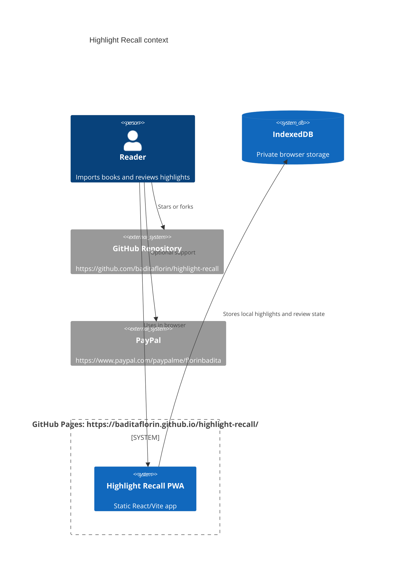

# Highlight Recall

Live app: https://baditaflorin.github.io/highlight-recall/

Repository: https://github.com/baditaflorin/highlight-recall

Support: https://www.paypal.com/paypalme/florinbadita


Highlight Recall is a local-first Readwise-style app for importing EPUB/PDF highlights, reviewing them with spaced repetition, and searching them without sending personal reading data to a server.

## Quickstart

```bash
npm install
make install-hooks
make build
make pages-preview
make smoke
```

## What It Does

- Imports EPUB, PDF, TXT, and Markdown files in the browser.
- Stores source documents, highlights, review state, and optional embeddings in IndexedDB.
- Resurfaces due highlights with an SM-2-style spaced repetition scheduler.
- Searches highlights locally with MiniSearch, with optional browser sentence-transformer embeddings.
- Shows version and commit on the live GitHub Pages app.

## Architecture



More detail: docs/architecture.md

ADRs: docs/adr/

Deploy guide: docs/deploy.md

Privacy: docs/privacy.md

## Development

```bash
make dev
make test
make lint
make build
make smoke
```

GitHub Pages is served from the tracked `docs/` directory on the `main` branch. Do not gitignore `docs/`.

## Versioning

The footer displays `package.json` version and the short git commit embedded at build time. Tags use semver, starting with `v0.1.0`.
