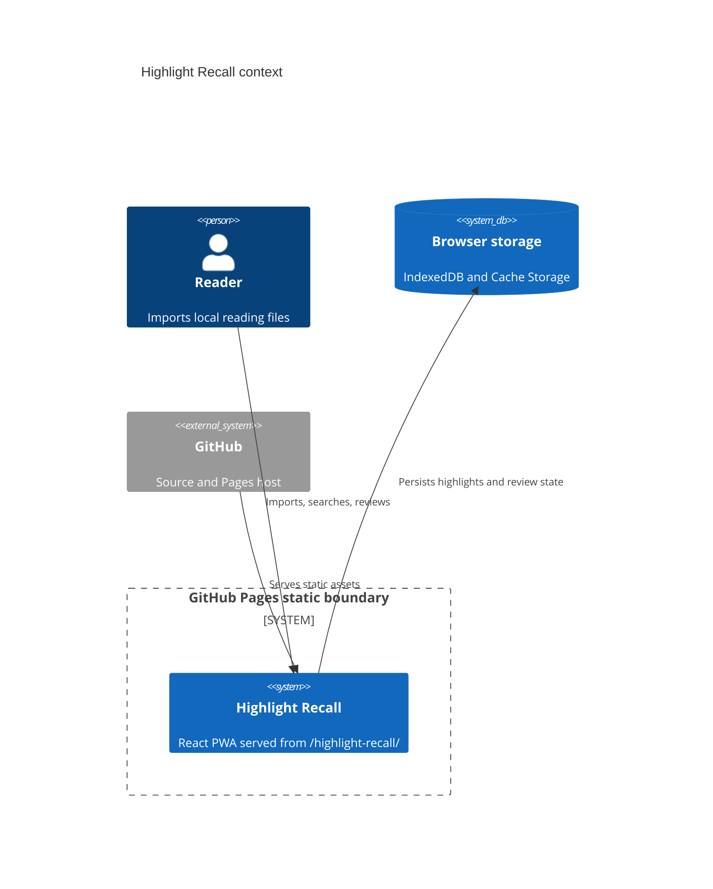
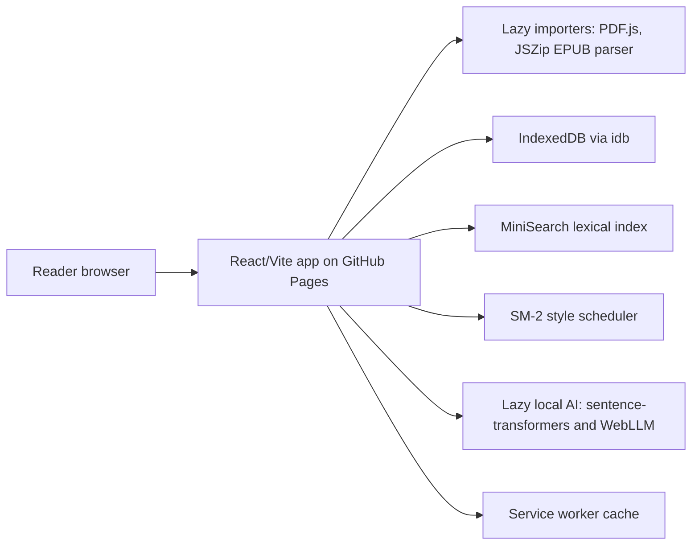

# Architecture

## Context

## Container

## Module Boundaries

- `src/features/library` owns import, manual capture, export, and library lists.
- `src/features/review` owns daily review flow.
- `src/features/search` owns search UI.
- `src/domain` owns schemas, scheduling, IDs, text helpers, and exports.
- `src/importers` owns file parsing and candidate highlight extraction.
- `src/storage` owns IndexedDB schema and persistence.
- `src/ai` owns optional lazy embedding and local LLM helpers.

## GitHub Pages Boundary

The public runtime is only:

https://baditaflorin.github.io/highlight-recall/

There is no API origin, auth callback, backend database, or server secret.
